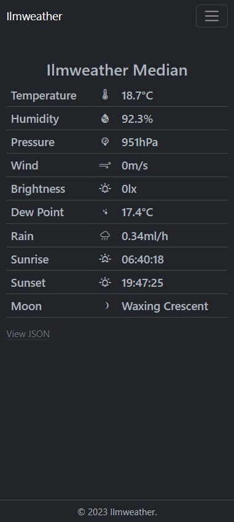
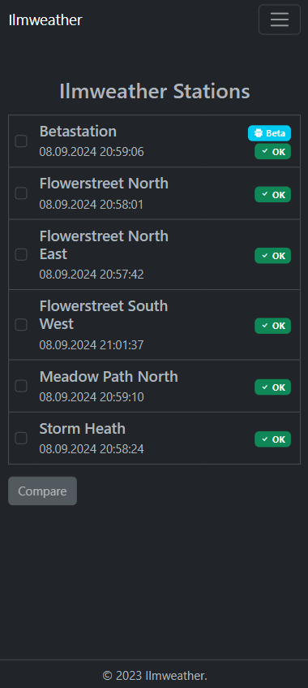
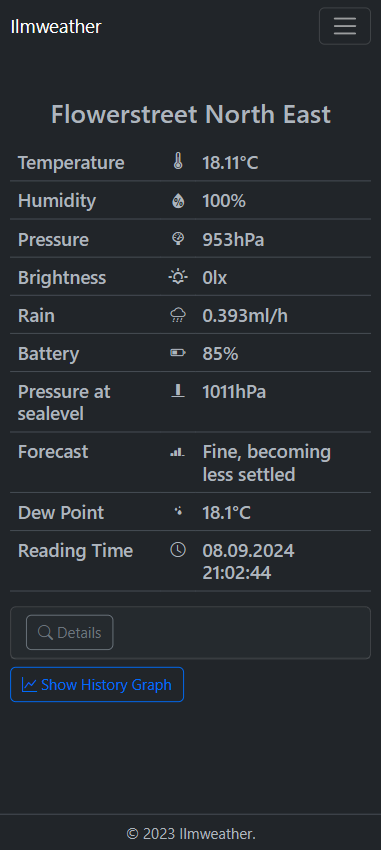
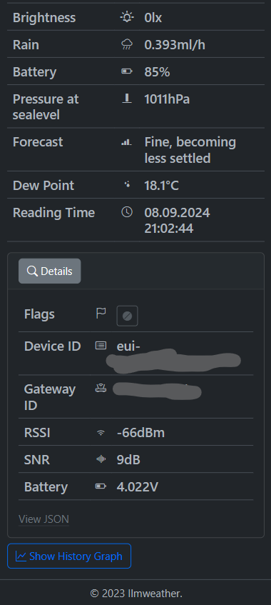
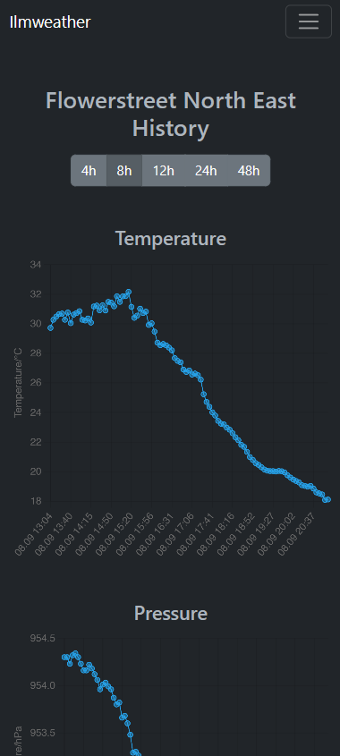
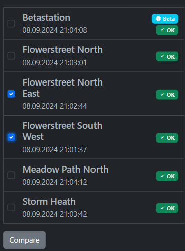
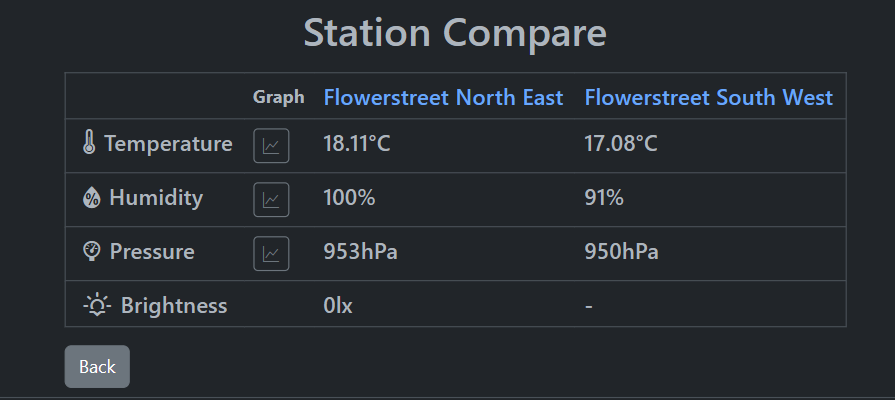
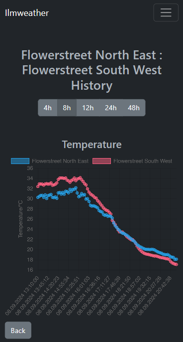
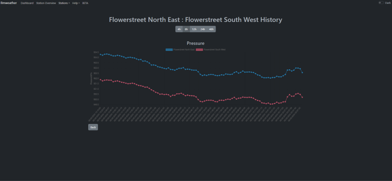

# LoRa Weather Evaluation

This is the evaluation tool for the [LoRa Weather Station Project](https://github.com/3komma3volt/LoRaWeatherStation_Hardware).
The project started as a small single file PHP script using MariaDB and small own CSS stylesheets for visualizing weather data. After growing the number of weather stations, the script was rewritten and uses responsive Bootstrap and chart.js for the frontend. The features have grown even more and was rewritten again using Symfony 7.

> Note: Not all described features are available in Symfony version. There are still some implementations missing.

## Features

### Dashboard

Shows a median of all weather stations. Currently the whole system is supposed to be used within one city, so a median makes sense. 
 
### Station Overview

Lists all available stations. Shows a stations as offline, if the last received data is older then 30 minutes. 

### Station Data

> Weather forecast and some calculated weather data are not implemented yet in the Symfony version

Shows all weather data of a selected station. Since every station can have different sensors, the shown data differs between the stations. A detail view shows a bit more information like signal strength, battery voltage.. The station data can be read as JSON and used e.g. in a home automation.

> Some calculations are not implemented yet in the Symfony version e.g. weather prediction, pressure at sealevel

 
### History Graph

 Shows all station data as graph for a selected timespan. The history data can be exported as CSV. 

### Compare

Shows a list of selected stations and all weather data. If at least two stations have the same sensor data, it is possible to do a graph compare. 

## Usage

  After deploying the app, go to the TheThingsStack control panel and select the weather app.
  Add a Webhook (Integrations -> Webhooks) for the application and use the URL of your server (Base URL) and select Uplink message as enabled event type:
  

From now on, the Webhook will send the station data JSON encoded to the Evaluation Tool and it will store the data into the MariaDB database.
