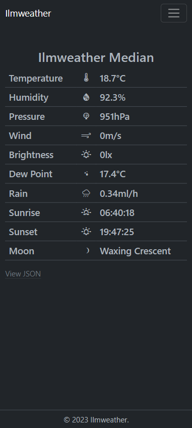
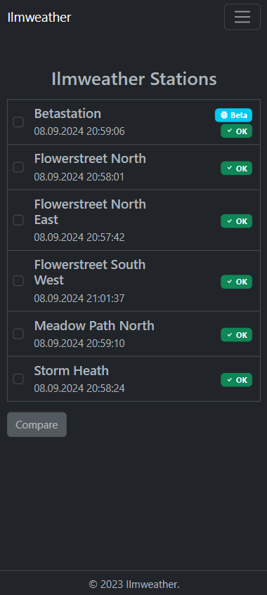
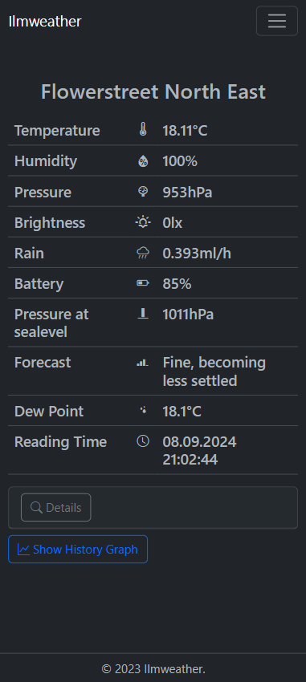
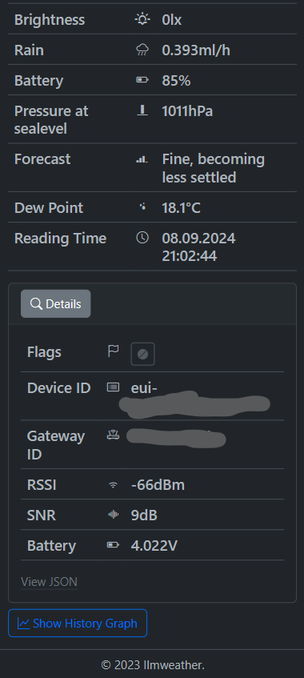
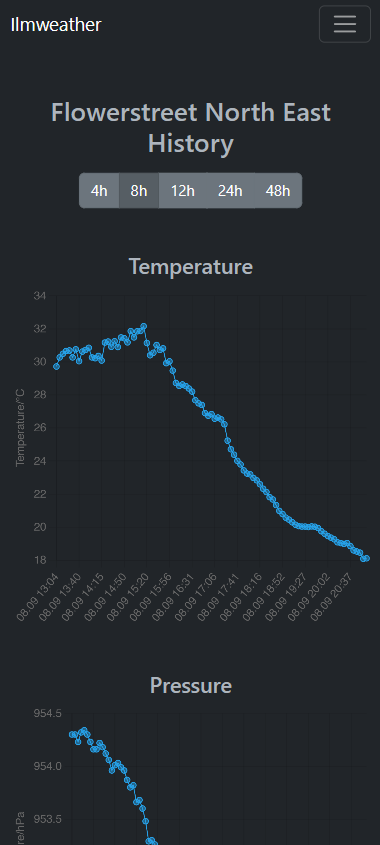
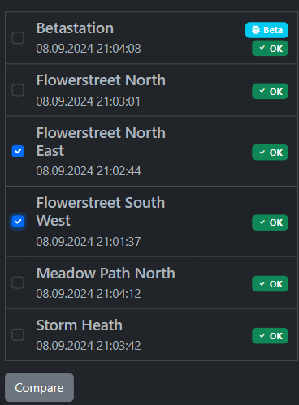
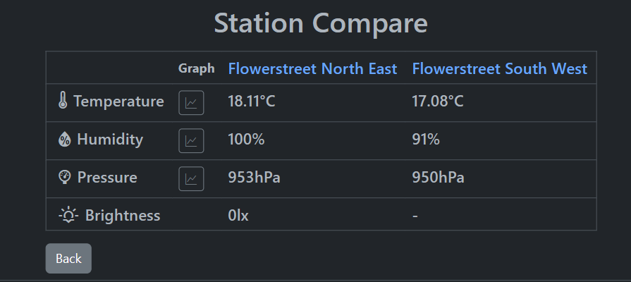
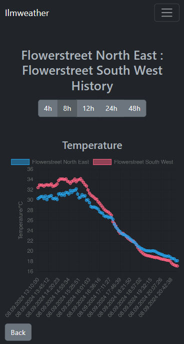
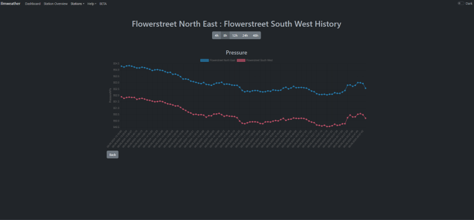
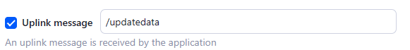

# LoRa Weather Evaluation

This is the evaluation tool for the [LoRa Weather Station Project](https://github.com/3komma3volt/LoRaWeatherStation_Hardware).
The project started as a small single file PHP script using MariaDB and small own CSS stylesheets for visualizing weather data. After growing the number of weather stations, the script was rewritten and uses responsive Bootstrap and chart.js for the frontend. The features have grown even more and was rewritten again using Symfony 7.

> Note: Weather forecast not available in Symfony version (yet).


## Features

### Dashboard



Shows a median of all weather stations. Currently the whole system is supposed to be used within one city, so a median makes sense. 
 
### Station Overview



Lists all available stations. Shows a stations as offline, if the last received data is older then 30 minutes. 

### Station Data



> Weather forecast is not implemented yet in the Symfony version

Shows all weather data of a selected station. Since every station can have different sensors, the shown data differs between the stations. A detail view shows a bit more information like signal strength, battery voltage.. The station data can be read as JSON and used e.g. in a home automation.



 
### History Graph



 Shows all station data as graph for a selected timespan. The history data can be exported as CSV. 

### Compare









Shows a list of selected stations and all weather data. If at least two stations have the same sensor data, it is possible to do a graph compare. 

## Usage

  After deploying the app, go to the TheThingsStack control panel and select the weather app.
  Add a Webhook (Integrations -> Webhooks) for the application and use the URL of your server (Base URL) and select Uplink message as enabled event type:
  


Set authentication to: basic auth and add username and password generated. (todo: add usermanagement in admin panel)

From now on, the Webhook will send the station data JSON encoded to the Evaluation Tool and it will store the data into the MariaDB database.

Currently there is no administration page, so you have to setup you station manually within the database. There you can enter an alias name and information like station location and altitude (needed for pressure calculation). You can also set its status like Beta test mode by editing the entry in the database.


## Integrating Home Assistant Sensors

If you have e.g. a temperature sensor which is read by Home Assistant you can send its data to the weather system using a restful request. For this, simulate a JSON request from TTN. This would look like this:

```yaml
update_weather_data_v3:
  username: !secret weather_user
  password: !secret weather_pass
  url: >-
    https://weathersystem.yoururl/updatedata
  method: POST
  content_type: application/json
  payload: >
    {
      "end_device_ids": {
        "device_id": "Your unique ID"
      },
      "uplink_message": {
        "decoded_payload": {
          "temperature": {{ states('sensor.temperature') }},
          "wind": {{ states('sensor.windspeed') }},
          "brightness": {{ states('sensor.brightness') }}
        },
        "rx_metadata": [
          {
            "gateway_ids": {
              "gateway_id": "WEB"
            }
          }
        ]
      }
    }
```

In the security.yaml add the credentials:

```yaml
weather_user: api@example.com
weather_pass: the_api_user_password
```


Then make an automation which calls the request every x minutes to upload the sensor data. Name the gateway ID as you want. E.g "WEB" to make a difference to an TTN gateway.

# Used libraries

[Weather Icons by Erik Flowers](https://github.com/erikflowers/weather-icons)

[Bootstrap](https://getbootstrap.com/)

[Chart.js](https://www.chartjs.org/)

[Symfony](https://symfony.com/) 

[MariaDB](https://mariadb.org/)